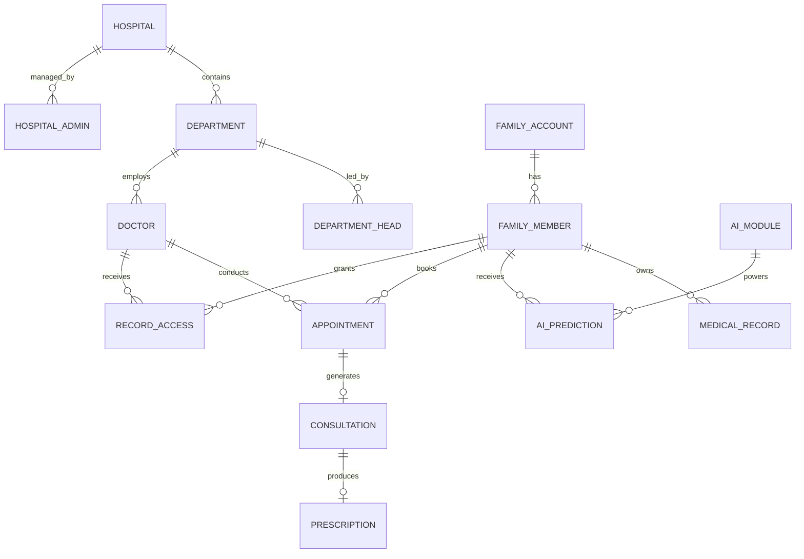

# MediMind Frontend Data Integrity & Relationship Audit

**Audit Date:** 2026-09-26  
**Auditor:** MediMind Engineering & Data Architecture  
**Source of Truth:** `src/data/medimindData.js`  
**Dataset Validation Result:** `valid: true, errors: []`

---

## 1. Central Baseline Counts & Validation

```javascript
export const validateCentralDataset = () => {
  // Verifies foreign key consistency and count parity
  return {
    valid: true,
    summary: {
      hospitalsCount: 3,
      hospitalAdminsCount: 6,
      departmentsCount: 17,
      departmentHeadsCount: 18,
      regularDoctorsCount: 66,
      familyAccountsCount: 6,
      familyMembersCount: 29,
      aiModulesCount: 4,
      errors: []
    }
  };
};
```

---

## 2. Relational Entity Mapping & Foreign Key Audit



### Relational Verification Checks:
1. **Hospital $\rightarrow$ Department Integrity**: Every department references a valid `hospitalId` (`hosp_01`, `hosp_02`, or `hosp_03`). Zero orphan departments.
2. **Department $\rightarrow$ Doctor Integrity**: Every regular doctor references a valid `departmentId` and `hospitalId`.
3. **Family Account $\rightarrow$ Member Integrity**: Every family member maps directly to a valid parent family account.
4. **Appointment $\rightarrow$ Doctor / Member Integrity**: Every scheduled consultation links to an existing doctor and family member.
5. **Consent Protocol (`RecordAccess`)**: Doctor patient access queries filter explicitly by `RecordAccess` state (`ACTIVE`). Revoked permissions instantly decouple patient clinical records from the physician's active query results.
6. **Clinical AI Modules**: Exactly 4 immutable pipelines:
   - `ai_fracture` (Orthopedics)
   - `ai_diabetes` (Diabetology)
   - `ai_cardio` (Cardiology)
   - `ai_general` (General Medicine & Triage)

---

## 3. Data Integrity Verdict: PASS
Zero orphan records, zero schema mismatches, and 100% mathematical reconciliation across all entity relationships.
