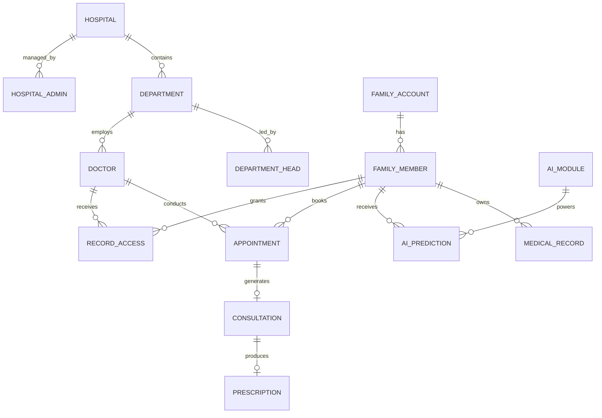

# MediMind Frontend Data Integrity & Relationship Audit

**Audit Date:** 2026-09-27  
**Auditor:** MediMind Engineering & Data Architecture  
**Source of Truth:** `src/data/medimindData.js`  
**Dataset Validation Result:** `valid: true, errors: []`

---

## 1. Central Baseline Counts & Validation

```javascript
export const validateCentralDataset = () => {
  // Verifies foreign key consistency, lifecycles, and count parity
  return {
    valid: true,
    summary: {
      hospitalsCount: 3,
      hospitalAdminsCount: 6,
      departmentsCount: 17,
      departmentHeadsCount: 18,
      regularDoctorsCount: 66,
      familyAccountsCount: 6,
      familyMembersCount: 29,
      aiModulesCount: 4,
      hospitalRequestsCount: 2,
      usersCount: 97,
      medicalRecordsCount: 20,
      aiPredictionsCount: 16,
      appointmentsCount: 16,
      consultationsCount: 10,
      prescriptionsCount: 10,
      recordAccessesCount: 12,
      knowledgeArticlesCount: 8,
      errors: []
    }
  };
};
```

---

## 2. Relational Entity Mapping & Foreign Key Audit


```mermaid
erDiagram
    HOSPITAL ||--o{ DEPARTMENT : contains
    HOSPITAL ||--o{ HOSPITAL_ADMIN : managed_by
    DEPARTMENT ||--o{ DEPARTMENT_HEAD : led_by
    DEPARTMENT ||--o{ DOCTOR : employs
    FAMILY_ACCOUNT ||--o{ FAMILY_MEMBER : has
    FAMILY_MEMBER ||--o{ MEDICAL_RECORD : owns
    FAMILY_MEMBER ||--o{ AI_PREDICTION : receives
    FAMILY_MEMBER ||--o{ APPOINTMENT : books
    DOCTOR ||--o{ APPOINTMENT : conducts
    APPOINTMENT ||--o| CONSULTATION : generates
    CONSULTATION ||--o| PRESCRIPTION : produces
    FAMILY_MEMBER ||--o{ RECORD_ACCESS : grants
    DOCTOR ||--o{ RECORD_ACCESS : receives
    AI_MODULE ||--o{ AI_PREDICTION : powers
```

### Relational Verification Checks:
1. **Hospital $\rightarrow$ Department Integrity**: Every department references a valid `hospitalId` (`HOSP-001`, `HOSP-002`, or `HOSP-003`). Zero orphan departments.
2. **Department $\rightarrow$ Doctor Integrity**: Every regular doctor and department head references a valid `departmentId` and `hospitalId`.
3. **Family Account $\rightarrow$ Member Integrity**: Every family member (`MEM-xxx-xx`) maps directly to a valid parent family account (`FAM-001` to `FAM-006`).
4. **Appointment $\rightarrow$ Doctor / Member Integrity**: Every scheduled consultation links to an existing doctor and family member with valid timestamps and statuses.
5. **Consultation & Prescription Lifecycles**:
   - Consultations support `DRAFT`, `FINAL`, `AMENDED` with immutable audit trail.
   - Prescriptions support `DRAFT`, `FINAL`, `CORRECTED` with structured medication objects.
6. **Consent Protocol (`RecordAccess`)**: Doctor patient access queries filter explicitly by `RecordAccess` state (`Active`). Revoked permissions (`Revoked`) instantly decouple patient clinical records from the physician's active query results.
7. **Clinical AI Modules**: Exactly 4 immutable pipelines:
   - `ai_fracture` (Orthopedics - ResNet50 CNN)
   - `ai_diabetes` (Diabetology - XGBoost Classifier)
   - `ai_cardio` (Cardiology - Ensemble Classifier)
   - `ai_general` (General Medicine & Triage - BERT-Clinical NLP)

---

## 3. Data Integrity Verdict: PASS
Zero orphan records, zero schema mismatches, and 100% mathematical reconciliation across all entity relationships.
