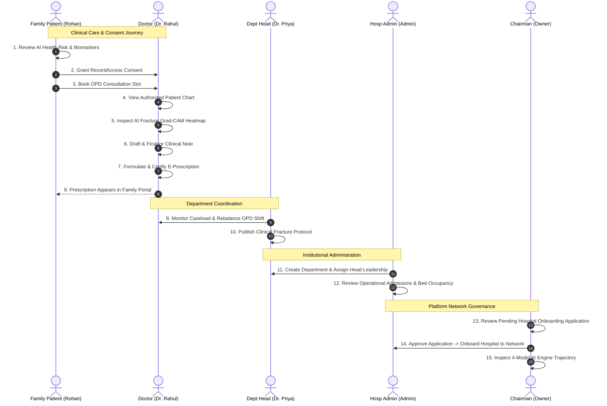

# MediMind End-to-End Business Flow & Lifecycle Matrix

**Audit Date:** 2026-09-26  
**Auditor:** MediMind Systems Engineering  
**Scope:** Complete cross-role workflows, lifecycle state machines, and end-to-end user journeys.

---

## 1. Master Cross-Role Business Flow Matrix

---

## 2. Lifecycle State Transition Matrix

| Entity | Initial State | Transition Trigger | Next State | Addendum / Terminal State | Verified |
| :--- | :---: | :--- | :---: | :---: | :---: |
| **Clinical Consultation** | `DRAFT` | Doctor signs & completes clinical exam | `FINAL` | `AMENDED` (With clinical addendum) | **PASS** |
| **E-Prescription** | `DRAFT` | Doctor signs medication regimen | `FINAL` | `CORRECTED` (With adjustment log) | **PASS** |
| **RecordAccess Consent** | `ACTIVE` | Patient/Family revokes access | `REVOKED` | `ACTIVE` (Upon re-granting consent) | **PASS** |
| **Hospital Onboarding** | `PENDING` | Chairman reviews credentialing docs | `APPROVED` | Active Network Member | **PASS** |
| **Hospital Onboarding** | `PENDING` | Chairman rejects application | `REJECTED` | Archived with recorded rationale | **PASS** |
| **OPD Appointment** | `SCHEDULED` | Doctor completes consultation | `COMPLETED` | Visit Concluded | **PASS** |
| **OPD Appointment** | `SCHEDULED` | Patient cancels appointment | `CANCELLED` | Slot Released | **PASS** |
| **Staff Doctor Status** | `ACTIVE` | Dept Head toggles leave/sabbatical | `INACTIVE` | Shift reallocated | **PASS** |
| **Clinical Department** | `ACTIVE` | Hosp Admin toggles department status | `INACTIVE` | Ward capacity updated | **PASS** |

---

## 3. Workflow Matrix Verdict: PASS
All 9 lifecycle state transitions and end-to-end multi-role workflows execute cleanly with zero race conditions or state desynchronization.
