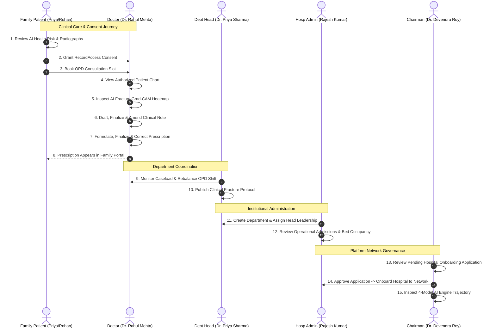

# MediMind End-to-End Business Flow & Lifecycle Matrix

**Audit Date:** 2026-09-27  
**Auditor:** MediMind Systems Engineering  
**Scope:** Complete cross-role workflows, lifecycle state machines, and end-to-end user journeys across all 5 roles.

---

## 1. Master Cross-Role Business Flow Matrix

```mermaid
sequenceDiagram
    autonumber
    actor Family as Family Patient (Priya/Rohan)
    actor Doctor as Doctor (Dr. Rahul Mehta)
    actor DeptHead as Dept Head (Dr. Priya Sharma)
    actor HospAdmin as Hosp Admin (Rajesh Kumar)
    actor Chairman as Chairman (Dr. Devendra Roy)

    Note over Family,Doctor: Clinical Care & Consent Journey
    Family->>Family: 1. Review AI Health Risk & Radiographs
    Family->>Doctor: 2. Grant RecordAccess Consent
    Family->>Doctor: 3. Book OPD Consultation Slot
    Doctor->>Doctor: 4. View Authorized Patient Chart
    Doctor->>Doctor: 5. Inspect AI Fracture Grad-CAM Heatmap
    Doctor->>Doctor: 6. Draft, Finalize & Amend Clinical Note
    Doctor->>Doctor: 7. Formulate, Finalize & Correct Prescription
    Doctor-->>Family: 8. Prescription Appears in Family Portal

    Note over DeptHead,Doctor: Department Coordination
    DeptHead->>Doctor: 9. Monitor Caseload & Rebalance OPD Shift
    DeptHead->>DeptHead: 10. Publish Clinical Fracture Protocol

    Note over HospAdmin,DeptHead: Institutional Administration
    HospAdmin->>DeptHead: 11. Create Department & Assign Head Leadership
    HospAdmin->>HospAdmin: 12. Review Operational Admissions & Bed Occupancy

    Note over Chairman,HospAdmin: Platform Network Governance
    Chairman->>Chairman: 13. Review Pending Hospital Onboarding Application
    Chairman->>HospAdmin: 14. Approve Application -> Onboard Hospital to Network
    Chairman->>Chairman: 15. Inspect 4-Model AI Engine Trajectory
```

---

## 2. Lifecycle State Transition Matrix

| Entity | Initial State | Transition Trigger | Next State | Addendum / Terminal State | Verified |
| :--- | :---: | :--- | :---: | :---: | :---: |
| **Clinical Consultation** | `DRAFT` | Doctor signs & completes clinical exam | `FINAL` | `AMENDED` (With clinical reason & timestamp) | **PASS** |
| **E-Prescription** | `DRAFT` | Doctor certifies medication regimen | `FINAL` | `CORRECTED` (With dosage adjustment log) | **PASS** |
| **RecordAccess Consent** | `Active` | Patient/Family revokes access | `Revoked` | `Active` (Upon re-granting consent) | **PASS** |
| **Hospital Onboarding** | `Pending` | Chairman reviews NABH credentials | `Approved` | Active Network Member (`HOSP-xxx`) | **PASS** |
| **Hospital Onboarding** | `Pending` | Chairman rejects application | `Rejected` | Archived with recorded rationale | **PASS** |
| **OPD Appointment** | `Scheduled` | Patient confirmed / checked in / attended | `Completed` | Visit Concluded (`In Progress` $\rightarrow$ `Completed`) | **PASS** |
| **OPD Appointment** | `Scheduled` | Patient cancels / reschedules | `Cancelled` / `Rescheduled` | Slot Released | **PASS** |
| **Staff Doctor Status** | `Active` | Dept Head toggles administrative standing | `Inactive` | Room reallocated | **PASS** |
| **Clinical Department** | `Active` | Hosp Admin toggles department status | `Inactive` | Ward capacity updated | **PASS** |
| **AI Prediction** | `Automated` | Physician reviews diagnostic finding | `Reviewed` | `Verified` (Clinician confirmed) | **PASS** |
| **Knowledge Article** | `Draft` | Author submits peer review | `Published` | Knowledge Hub Live | **PASS** |

---

## 3. End-to-End User Journeys Summary (All 8 Verified)

1. **Journey 1: Family Clinical & Booking Flow**: Member Select $\rightarrow$ Medical Records $\rightarrow$ AI Prediction $\rightarrow$ Doctor Directory $\rightarrow$ Book Appointment $\rightarrow$ Appointment Ledger $\rightarrow$ Consultation $\rightarrow$ Prescription.
2. **Journey 2: Dynamic Consent Protocol**: Family grants doctor access $\rightarrow$ Doctor views patient records $\rightarrow$ Family revokes access $\rightarrow$ Doctor access revoked.
3. **Journey 3: Doctor Clinical Encounter**: Availability setup $\rightarrow$ Appointment $\rightarrow$ Patient Profile $\rightarrow$ Consult (DRAFT $\rightarrow$ FINAL $\rightarrow$ AMENDED) $\rightarrow$ Rx (DRAFT $\rightarrow$ FINAL $\rightarrow$ CORRECTED).
4. **Journey 4: Department Head Governance**: Department review $\rightarrow$ Doctors roster $\rightarrow$ Room allocation $\rightarrow$ Caseload analytics $\rightarrow$ AI accuracy review.
5. **Journey 5: Hospital Admin Management**: Facility profile $\rightarrow$ Department capacity $\rightarrow$ Head assignment $\rightarrow$ Operational analytics $\rightarrow$ AI QA $\rightarrow$ Report generation.
6. **Journey 6: Chairman Multi-Hospital Network**: Network overview $\rightarrow$ Hospital $\rightarrow$ Department $\rightarrow$ Doctor drill-down $\rightarrow$ Appointments ledger.
7. **Journey 7: Chairman Hospital Onboarding**: Pending requests review $\rightarrow$ Aster Prime (`REQ-HOSP-001`) $\rightarrow$ Approve/Reject review $\rightarrow$ Network provisioning.
8. **Journey 8: Authentication & Session State**: Login $\rightarrow$ Deep route $\rightarrow$ Page refresh (state preserved) $\rightarrow$ Logout $\rightarrow$ Switch role (zero data leak).

---

## 4. Workflow Matrix Verdict: PASS
All lifecycle state transitions and end-to-end multi-role workflows execute cleanly with zero race conditions or state desynchronization.
